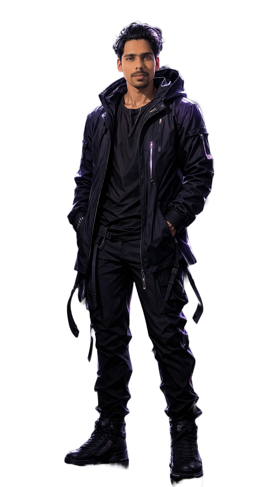

 

  

## 🧠 About Me

- 🤖 I engineer **GenAI systems** — LLM apps, RAG pipelines, and autonomous agents
- 🔭 Currently building **[project name]**
- 🌱 Currently deep-diving into **[technology / paper / framework]**
- 💬 Ask me about **LLMs, RAG, prompt engineering, agentic workflows**
- 📫 Reach me at **[your email or contact link]**
- ⚡ Fun fact: **[something about you]**

 

## 🛠️ Tech Stack

<b>LANGUAGES</b>
 

  

<b>FRAMEWORKS</b>
 

  

<b>DATABASES & VECTOR STORES</b>
 

  

<b>AI DOMAINS</b>
 

  

<b>INFRA & CLOUD</b>
 

 

✏️ swap icons to match your real stack — <a href="https://skillicons.dev">skillicons.dev</a>

## 📊 GitHub Stats

 

 

## 🌐 Connect With Me

 

  

